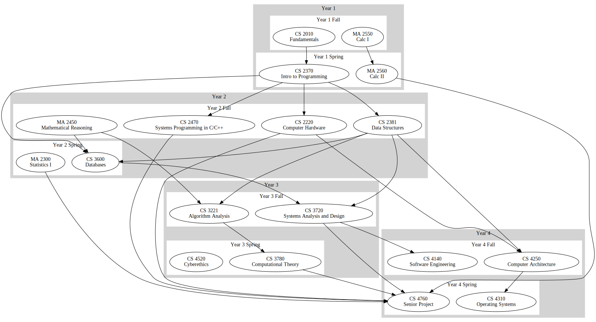
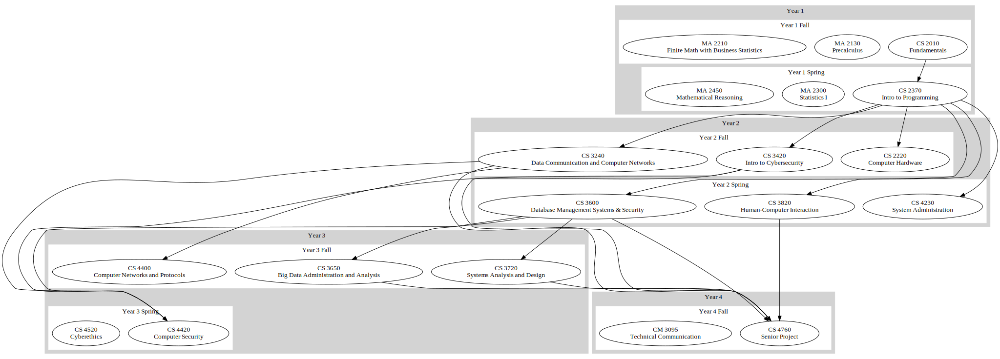
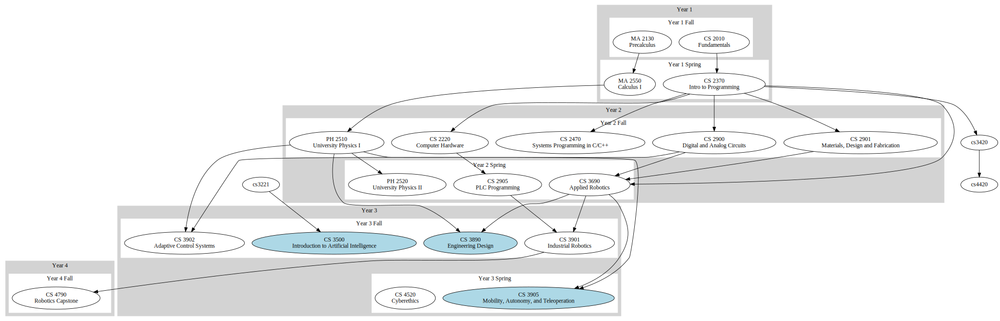
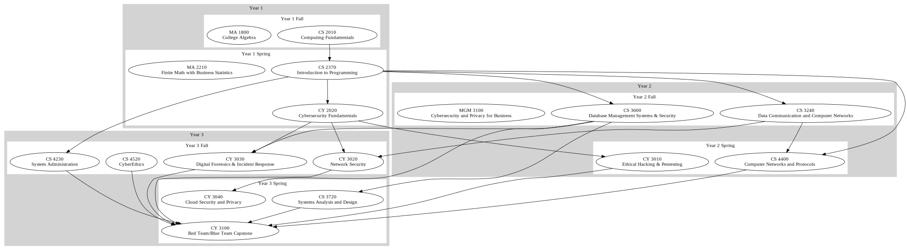
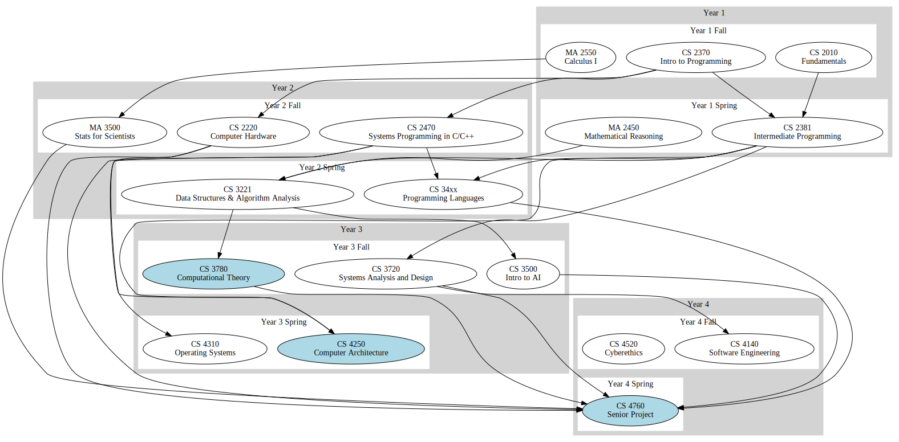

## Current Course Sequences

(Click to Zoom)

**Computer Science**

**Information Technology**

**Robotics**

(Light blue is 4-year-only)

**Cybersecurity (3 year)**

## Proposed CS 2026 Sequence

**Computer Science**

(Light blue is 4-year-only)

Why? Full coverage of the ACM 2023 core: [Proposed mapping to ACM 2023 Core](./acm-cs-2023-core-mappings)
