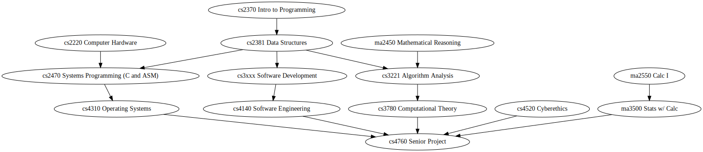

Here's the required courses for the Plymouth State CS program:

(Click to Zoom)

There are six rows, which students need to fit in over 8 semesters.

Students are also required to complete two electives. The electives
require the following courses:

 - No other CS Prereq: 3 courses
 - cs2010 Fundamentals: 1 Course
 - cs2370 Intro to Programming: 7 Courses
 - cs2381 Data Structures: 1 Course
 - cs3221 Algorithms: 1 Course
 - cs3720 Systems Analysis: 1 Course

It takes two or three semesters for students to really get comfortable
with programming. Advanced programming electives would optimally
require a Programming III prereq, but minimally Programming II. That
means the program currently only includes three advanced programming
electives:

 - System Administration (requires Systems Analysis, why?)
 - Artificial Intellegence (requires Algo)
 - Mobile Development (requires Data Structures)

Several of the other electives sound like they should cover advanced
programming topics, but they're restricted by the lack of prereqs:

 - Web Programming (aka "Software Engineering with Distributed Systems")
 - The Computer Networks sequence
 - Big Data Admin and Analysis (now more of a CIS/Data Science class?)
 - Computer Security (Crypto? Memory layout stuff?)

If we remove the cs2010 prereq for Intro to Programming and suggest
that students take programming their first semester we're down to five
rows. Further, we could conceptually change the pre-req for 7
electives from cs2370 to cs2381, which would make students in those
courses much more prepared for significant programming projects.

That minimum change looks like this:

(Click to Zoom)

I think that change is a good deal even if it means making cs2370
significantly easier.

## Radical Cuts

If I were completely redoing the program, the first thing I'd do is to
try to free up as much space as possible by removing stuff I don't
personally need.

Here's some changes:

 - Cut Calc II, but move to Calculus-based Prob & Stats
 - Cut Archetecture, split its content into Hardware and Systems
   Programming
 - Systems Programming in C becomes the prereq for OS
 - Cut Systems Analysis and Databases
 - Add Programming III (Software Development)

(Click to Zoom)

That's four cuts, so it leaves space for four new things.

## What to add?

Courses that other schools require:

 - Programming Languages (comparative or theoretical)
 - Discrete Math
 - Intro to Linear Algebra
 - Computer Networks

Dunno about the math, but the other two seem better than requiring
Databases. I'd be happy teaching either.

Require a two-elective course sequence, e.g.:

 - (SW Dev) -> Web Dev -> Web Dev II
 - (SW Dev & Sys Programming) -> Programming Languages -> Compilers
 - (Calc I) -> Calc 2 -> Linear Algebra -> Machine Learning
 - (Stats & Algo) -> AI -> Robot Control in Simulation
 - (SW Dev) -> Networks (& OS) -> Distributed Systems
 - (SW Dev) -> Graphics Programming -> Game Development

Given the course sequence, I think SW Engineering can be an elective.
That gives us space for more math.

(Click to Zoom)

Some noteworthy links:

 - [The million courses that Dartmouth offers](
 https://dartmouth.smartcatalogiq.com/en/current/orc/departments-programs-undergraduate/computer-science/cosc-computer-science-undergraduate/)
 - [Bridgewater State's reqs](
 https://www.bridgew.edu/academics/majors-minors-undergraduate/computer-science)
 - [Salem State has a Survey Course](
 https://catalog.salemstate.edu/preview_program.php?catoid=36&poid=4126&hl=Computer+Science&returnto=search)

