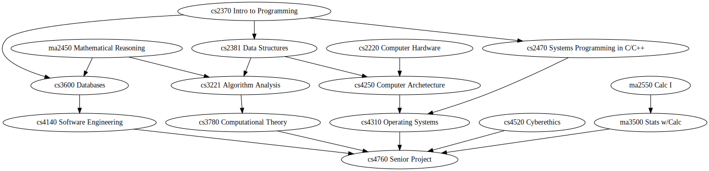

# The Current Program

Here's the required courses for the Plymouth State CS program:

(Click to Zoom)

There are six rows, which students need to fit in over 8 semesters.

Logically, this feels like four sequences:

 - Theory: Mathematical Reasoning -> Algo -> Theory
 - Software Dev: Intro to Programing -> Data Structs, DBs -> Systems
   Analysis -> Sw Eng
 - Low Level: Systems Programming, Hardware -> Archetecture -> OS
 - Calc

And then there are three other required courses: Fundamentals, Cyberethics,

Students are also required to complete two electives. The electives
require the following courses:

 - No other CS Prereq: 3 courses
 - cs2010 Fundamentals: 1 Course
 - cs2370 Intro to Programming: 7 Courses
 - cs2381 Data Structures: 1 Course
 - cs3221 Algorithms: 1 Course
 - cs3720 Systems Analysis: 1 Course
 
That means that only three of our electives require two semesters of
programming. That means the others can't require serious programming
projects - the students aren't prepared for that.

Compared to other programs I've looked at, our current program is different in a
couple of ways:

 - The inclusion of DB and Systems Analysis as requirements.
   - This feels like an implementation of the idea that data design is the
     core of programming, which is great.
   - I'm not convinced that UML-adjacent stuff is actually helpful.
 - More courses covering low level stuff. Our archetecture course is a
   major late project course on a microcontroller, which isn't typical.
 - Missing a Programming Languages course.
 - Very light on late electives.

## Top Suggestion: Start Programming Immediately

If we remove the cs2010 prereq for Intro to Programming and suggest
that students take programming their first semester that reduces the
depth of the graph from six to five.

Doing this let us increase the pre-req for many of the electives from
cs2370 to either cs2381 or cs2470, which would allow those electives
to include more serious programming projects.

That minimum change: (Click to Zoom)

I think that change is a good deal even if it means making cs2370
significantly easier.

I'm not sure what to do with cs2010 if it's not a prereq for anything.
Make it a non-majors course maybe?

### Alternative: Make cs2010 a Programming Course

Just make it programming: (Click to Zoom)

As I teach through my first semester of cs2381, I'm becoming more and
more convinced that the students would do better with the course
material if they had a full semester more of programming prep.

There are a couple of extra changes in this graph to implement
suggestions I make below.

That raises the question of what programming goes before cs2370, my
suggestion would be:

 - JavaScript, in the browser, for the browser.
 - A focus on pure functions and design with value data, using
   functional-reactive libraries to show web pages and interactive
   graphics.
 - Testing with pure functions and immutable data.

This would set up cs2370 to be able to cover topics like an explicit
imperative notional machine, command line scripting, use of standard
data structures, external libraries, and testing with mutable data.

This has a similar effect on existing electives as cutting cs2010 and
moving their pre-reqs up one, but isn't as good at enabling late
electives since it leaves the graph 6 levels deep.

## Other Core Suggestions

**Cut Calc II**

Maybe some electives like Computer Graphics depend directly on heavy
use of calculus, but I think the main benefit of Calc is simply to
create a shared knowledge base both between programmers and across
disciplines.

I think one semester of Calc provides most of the practical benefit.

**Move to Calculus-based Prob & Stats**

Trying to do Prob & Stats without Calculus is like trying to do
Physics without Calculus - it's actively not as good. And a good
understanding of Prob & Stats feeds into more elective topics than
Calc does directly.

**Unnest Computer Hardware**

The topics in this course don't seem to depend on Intro to
Programming, so if we remove the prereq it makes paths shorter.

**Make Systems Programming a Pre-req for OS**

Knowing C is a logical pre-req for writing complex C code.

**Cut Systems Analysis and Design**

Maybe Chesterton's Fence applies here, but I think data design is
covered sufficiently elsewhere.

Core suggestions: (Click to Zoom)

That's three cuts, so that leaves us space to put in new stuff.

# Plan A: Required Late-Elective Project Sequence

The thing that I'd personally be looking for as a student in a CS
program is a good selection of late electives. Once you learn to
program, getting to play with applications is the fun part.

I really like the idea of a two-course project sequence, e.g.:

 - (SW Dev) -> Web Dev -> Web Dev II
 - (SW Dev & Sys Programming) -> Programming Languages -> Compilers
 - (Calc I) -> Calc 2 -> Linear Algebra -> Machine Learning
 - (Stats & Algo) -> AI -> Autonomous Robot Control
 - (SW Dev) -> Networks (& OS) -> Distributed Systems
 - (SW Dev) -> Graphics Programming -> Game Development

That leaves us one slot for a required course. The most common course
we're missing is a Programming Languages course, so we could add that.

Two-course project v1: (Click to Zoom)

If we want to go all in on this approach, software engineering and the
senior project are kind of redundant to the course sequence.

And if we cut the rest of the existing SW Dev sequence, then keeping
Databases doesn't seem nesisary. But having something would be good,
so we could swap out Databases for a Sw Dev class (probably build a
web app that uses a database as part of a team).

Two-course project xtreem: (Click to Zoom)

That leaves us two free slots. Either bonus electives or add Calc II
and Network Programming.

## Plan B: Focus on Software Dev / Web Dev

Our current curriculum has two more courses in the software design /
development track than is typical: Databases and Systems Analysis.

Rather than trying to make our curriculum more typical, we could
double down on that sort of focus.

A practical and broadly applicable domain is Web Development, so we
could do a sequence that focuses on scaling software projects in that
area.

Web Dev Sequence: (Click to Zoom)

# Links

 - [The million courses that Dartmouth offers](
 https://dartmouth.smartcatalogiq.com/en/current/orc/departments-programs-undergraduate/computer-science/cosc-computer-science-undergraduate/)
 - [Bridgewater State's reqs](
 https://www.bridgew.edu/academics/majors-minors-undergraduate/computer-science)
 - [Salem State has a Survey Course](
 https://catalog.salemstate.edu/preview_program.php?catoid=36&poid=4126&hl=Computer+Science&returnto=search)

